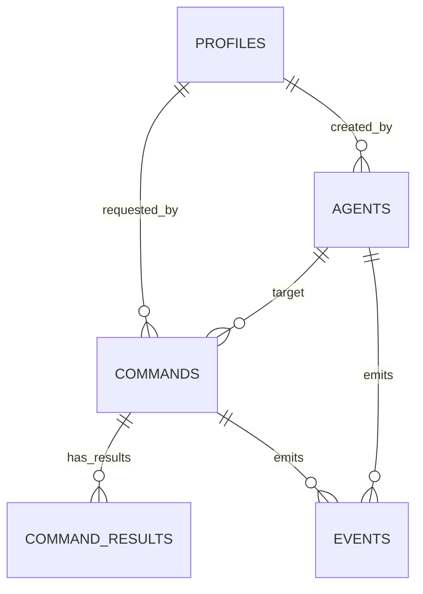

# Kolony MVP DB Schema

## Overview
This schema supports the MVP command center workflow:
- user roles (`viewer`, `operator`, `admin`)
- agent registry and heartbeat status
- command lifecycle tracking
- command output chunks/final results
- normalized event timeline

## Tables
- `profiles`: app role per authenticated user (`auth.users` link).
- `agents`: registered agents and runtime status metadata.
  - static-token auth columns: `token_hash`, `token_hint`, `token_active`
- `commands`: command requests and lifecycle state.
  - claim/lease columns: `claimed_by_agent_id`, `claimed_at`, `lease_expires_at`, `attempt_count`, `last_claim_error`
- `command_results`: streamed/final command output records.
- `events`: agent/command activity timeline.

## Enums
- `app_role`: `viewer`, `operator`, `admin`
- `agent_status`: `online`, `offline`, `busy`, `error`
- `command_status`: `draft`, `queued`, `dispatching`, `executing`, `completed`, `failed`, `cancelled`

## Relationship Diagram

## Security Model (MVP)
- RLS enabled on all tables.
- Authenticated users can `SELECT` from core tables.
- Write operations are role-gated:
  - `operator` and `admin`: write to `agents`, `commands`, `command_results`, `events`
  - `profiles`: self-bootstrap insert as `viewer`; self update restricted; admin override supported

## Performance Notes
- Composite indexes on command status/timestamps and owner dimensions.
- Partial indexes on `events` for `agent_id` and `command_id`.
- `updated_at` triggers on mutable core tables (`profiles`, `agents`, `commands`).

## Migration File
- `supabase/migrations/20260215161000_initial_schema.sql`
- `supabase/migrations/20260215170000_agent_static_tokens.sql`
- `supabase/migrations/20260215221000_command_claim_leases.sql`
